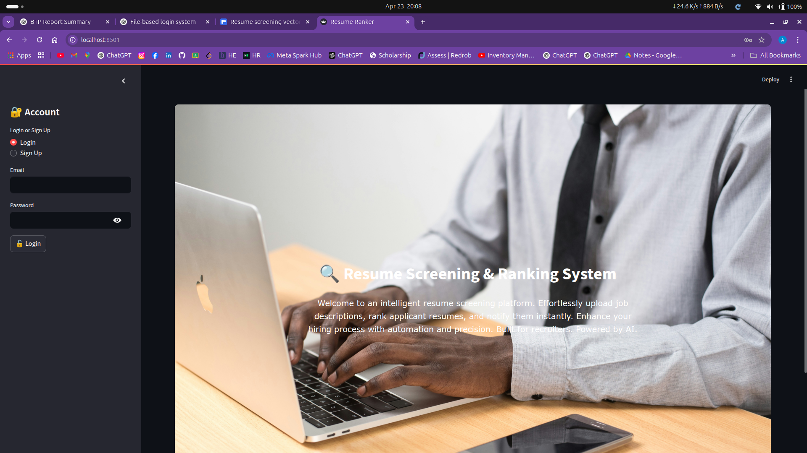
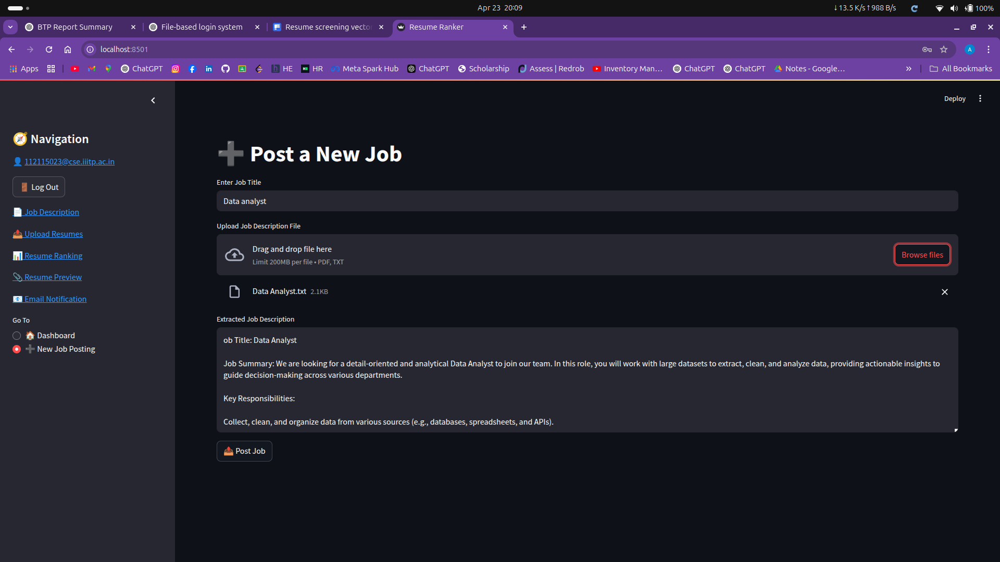
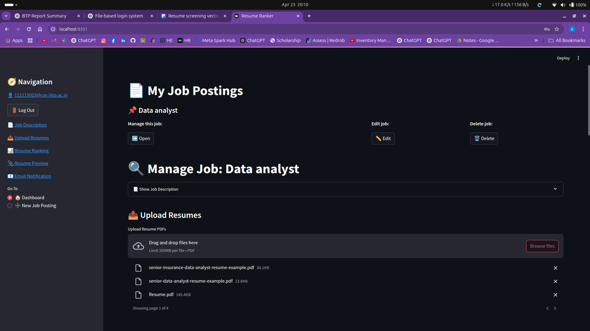
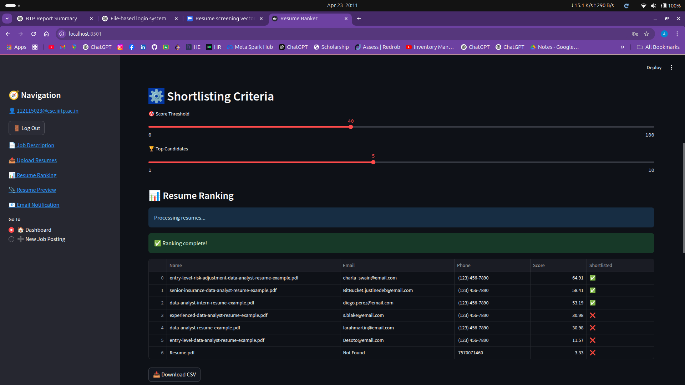
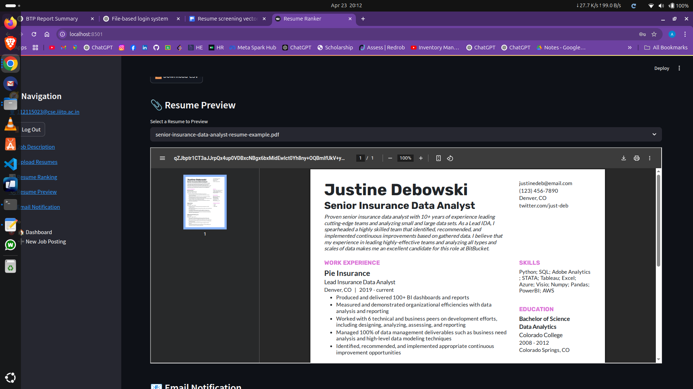

# AI-Powered_Resume_Screening_And_Ranking_System

## Overview
AI-Powered Resume Screening And Ranking System is an AI-driven platform that automates screening and ranking of resumes against job descriptions — saving recruiters time and improving hiring accuracy. It extracts skills and experience from resumes based on a custom skill database, ranks candidates using TF-IDF and cosine similarity, and sends personalized email notifications.

## Features
- AI-powered resume ranking using extracted skills & experience
- Upload job descriptions and multiple resumes for batch processing
- Skill extraction using a custom-built skill database
- Shortlist candidates based on ranking scores
- Personalized email notifications for shortlisted and rejected candidates
- Recruiter authentication (signup/login)
- Preview resumes directly within the app
- Fully containerized using Docker & Docker Compose for easy deployment

## Dependencies
- Python 3.x
- Streamlit
- PyPDF2
- scikit-learn
- regex
- SMTP (for email notifications)
- Docker & Docker Compose

## How to Use
1. Clone the repository to your local machine:
   git clone https://github.com/yourusername/AI-Powered_Resume_Screening_And_Ranking_System.git
   cd AI-Powered_Resume_Screening_And_Ranking_System

2. Run pip install -r requirements.txt
   
3. Run the application using Docker Compose:
   docker-compose up

4. Open your browser and visit http://localhost:8501 to access the app.

5. Sign up or log in as a recruiter.

6. Upload a job description file and multiple candidate resumes.

7. The system extracts relevant skills & experience, ranks the resumes, and displays the results.

8. Shortlist candidates and send personalized emails directly from the interface.

9. Preview resumes inside the app to quickly review candidate profiles.

## 🖥️ Screenshots
Below is a preview of the application interface:

### 📌 Homepage

### 📌 Dashboard

### 📌 Job posting

### 📌 Ranking result

### 📌 Resume preview

## Acknowledgment
Libraries
This project utilizes several open-source libraries and tools:
- Streamlit: Web app framework for Python
- PyPDF2: PDF text extraction
- scikit-learn: Machine learning algorithms
- regex: Advanced text matching
- SMTP: Sending email notifications
- Docker: Containerization platform

## Author
Apoorv Gupta

## License
This project is for educational use only. No distribution or reproduction without permission.
